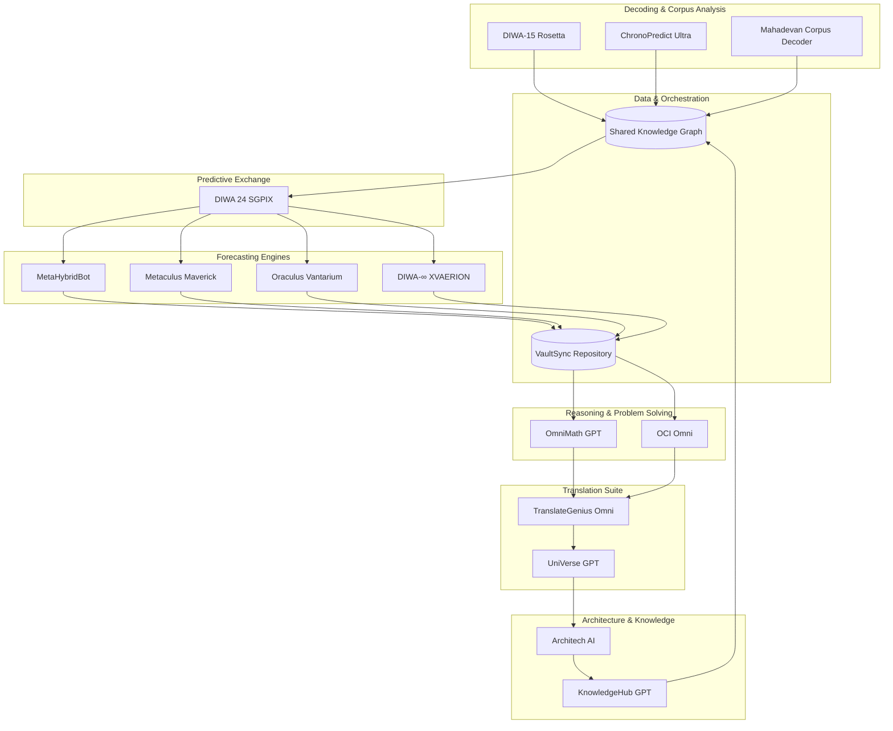

# Repository Architecture

The OmniRosetta codebase is organized as a modular Python package under `src/omnirosetta`. The structure mirrors the ecosystem's multidisciplinary agents, enabling teams to develop each capability independently while sharing governance and data standards.

```
src/
└── omnirosetta/
    ├── __init__.py
    └── modules/
        ├── architech_ai/
        ├── chronopredict_vinf_sigma_p/
        ├── diwa15_rosetta/
        ├── metahybridbot_oraculus_metaculus_maverick/
        ├── omni_math_gpt/
        ├── sgpix_diwa24/
        ├── translategenius_omni/
        └── translategenius_universe/
```

Each module exports a stub class describing its interface. These classes act as integration contracts for future model implementations and provide an immediate documentation surface for expected inputs and outputs.
# OmniRosetta-LLM Systems Architecture

This document maps the primary subsystems that compose OmniRosetta-LLM and highlights how data flows among research, reasoning, forecasting, translation, and architecture design workflows. All components adhere to the repository's ethical and transparency commitments.



## Subsystem Responsibilities

### Decoding & Corpus Analysis
* **DIWA-15 Rosetta** – Applies 170 tiered decoding methods to undeciphered scripts, combining linguistic, archaeological, and predictive signals.
* **ChronoPredict Ultra** – Introduces temporal modeling and scenario timelines to contextualize decoded inscriptions.
* **Mahadevan Corpus Decoder** – Focuses on Indus Valley epigraphy and statistical pattern discovery.

### Forecasting Engines
* **MetaHybridBot** – Blends Delphi-style human reasoning with ensemble AI forecasts for scenario vetting.
* **Metaculus Maverick** – Delivers tournament-grade probability distributions for technology, geopolitics, and climate outcomes.
* **Oraculus Vantarium** – Calibrates forecasts with Bayesian ensembles and audit trails for reproducibility.
* **DIWA-∞ XVAERION** – Continuously scans live signals and updates forecasts autonomously.

### Predictive Exchange
* **DIWA 24 SGPIX** – Aggregates decoded insights, forecasts, and translation outputs to coordinate cross-module intelligence workflows.

### Reasoning & Problem Solving
* **OmniMath GPT** – Performs mathematical, logical, and coding problem solving with recursive validation.
* **OCI Omni** – Provides ethical, multimodal reasoning and dialogue that supervises sensitive operations.

### Translation Suite
* **TranslateGenius Omni** – Provides deterministic translation with auto-detection, glossary control, and CLI orchestration hooks.
* **UniVerse GPT** – Offers open-source translation pipelines emphasizing privacy and transparency.

### Architecture & Knowledge
* **Architech AI** – Generates system blueprints (e.g., Mermaid diagrams, knowledge graphs) from natural language prompts.
* **KnowledgeHub GPT** – Curates and synthesizes cross-disciplinary research findings for other modules.

### Data & Orchestration
* **Shared Knowledge Graph** – Centralizes structured insights collected from decoding, forecasting, and research modules.
* **VaultSync Repository** – Version-controls forecasts, translation artifacts, and problem-solving traces while supplying downstream reasoning engines.

## Integration Notes

1. **Feedback Loops:** Forecasting modules send calibration data back into the Shared Knowledge Graph, enabling DIWA-15 Rosetta and ChronoPredict Ultra to refine their decoding heuristics.
2. **Ethical Guardrails:** OCI Omni enforces access policies and bias audits across translation and forecasting pipelines.
3. **Documentation Generation:** Architech AI converts orchestration states into Mermaid diagrams for repository documentation, keeping the architecture self-describing.
4. **Knowledge Recycling:** KnowledgeHub GPT aggregates outputs across modules and feeds novel insights into subsequent decoding or forecasting cycles.

For implementation specifics, refer to the module stubs within the `src/` directory and the higher-level overview in `docs/architecture_overview.md`.
